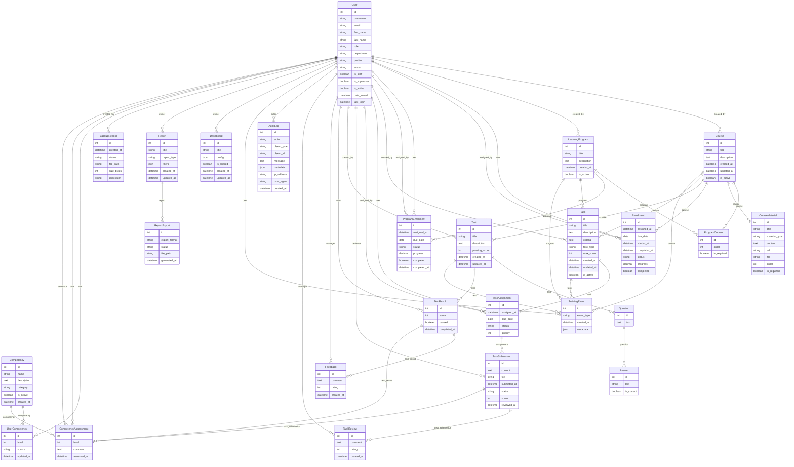

```mermaid
erDiagram
    User {
        int id
        string username
        string email
        string first_name
        string last_name
        string role
        string department
        string position
        string avatar
        boolean is_staff
        boolean is_superuser
        boolean is_active
        datetime date_joined
        datetime last_login
    }

    Competency {
        int id
        string name
        text description
        string category
        boolean is_active
        datetime created_at
    }

    UserCompetency {
        int id
        int level
        string source
        datetime updated_at
    }

    CompetencyAssessment {
        int id
        int level
        text comment
        datetime assessed_at
    }

    Course {
        int id
        string title
        text description
        datetime created_at
        datetime updated_at
        boolean is_active
    }

    LearningProgram {
        int id
        string title
        text description
        datetime created_at
        boolean is_active
    }

    ProgramCourse {
        int id
        int order
        boolean is_required
    }

    CourseMaterial {
        int id
        string title
        string material_type
        text content
        string url
        string file
        int order
        boolean is_required
    }

    Enrollment {
        int id
        datetime assigned_at
        date due_date
        datetime started_at
        datetime completed_at
        string status
        decimal progress
        boolean completed
    }

    ProgramEnrollment {
        int id
        datetime assigned_at
        date due_date
        string status
        decimal progress
        boolean completed
        datetime completed_at
    }

    Task {
        int id
        string title
        text description
        text criteria
        string task_type
        int max_score
        datetime created_at
        datetime updated_at
        boolean is_active
    }

    TaskAssignment {
        int id
        datetime assigned_at
        date due_date
        string status
        int priority
    }

    TaskSubmission {
        int id
        text content
        string file
        datetime submitted_at
        string status
        int score
        datetime reviewed_at
    }

    Test {
        int id
        string title
        text description
        int passing_score
        datetime created_at
        datetime updated_at
    }

    Question {
        int id
        text text
    }

    Answer {
        int id
        string text
        boolean is_correct
    }

    TestResult {
        int id
        int score
        boolean passed
        datetime completed_at
    }

    Feedback {
        int id
        text comment
        int rating
        datetime created_at
    }

    TaskReview {
        int id
        text comment
        int rating
        datetime created_at
    }

    AuditLog {
        int id
        string action
        string object_type
        string object_id
        text message
        json metadata
        string ip_address
        string user_agent
        datetime created_at
    }

    TrainingEvent {
        int id
        string event_type
        datetime created_at
        json metadata
    }

    Dashboard {
        int id
        string title
        json config
        boolean is_shared
        datetime created_at
        datetime updated_at
    }

    Report {
        int id
        string title
        string report_type
        json filters
        datetime created_at
        datetime updated_at
    }

    ReportExport {
        int id
        string export_format
        string status
        string file_path
        datetime generated_at
    }

    BackupRecord {
        int id
        datetime created_at
        string status
        string file_path
        int size_bytes
        string checksum
    }

    User ||--o{ Course : created_by
    User ||--o{ LearningProgram : created_by
    User ||--o{ Enrollment : user
    User ||--o{ Enrollment : assigned_by
    User ||--o{ ProgramEnrollment : user
    User ||--o{ ProgramEnrollment : assigned_by
    User ||--o{ Task : created_by
    User ||--o{ TaskAssignment : user
    User ||--o{ TaskAssignment : assigned_by
    User ||--o{ TaskSubmission : reviewer
    User ||--o{ Test : created_by
    User ||--o{ TestResult : user
    User ||--o{ Feedback : manager
    User ||--o{ TaskReview : manager
    User ||--o{ AuditLog : actor
    User ||--o{ TrainingEvent : user
    User ||--o{ Dashboard : owner
    User ||--o{ Report : owner
    User ||--o{ BackupRecord : created_by
    User ||--o{ UserCompetency : user
    User ||--o{ CompetencyAssessment : user
    User ||--o{ CompetencyAssessment : assessor

    Competency ||--o{ UserCompetency : competency
    Competency ||--o{ CompetencyAssessment : competency

    Course ||--o{ ProgramCourse : course
    LearningProgram ||--o{ ProgramCourse : program
    Course ||--o{ CourseMaterial : course
    Course ||--o{ Enrollment : course
    LearningProgram ||--o{ ProgramEnrollment : program
    Course ||--o{ Test : course
    Course ||--o{ Task : course
    LearningProgram ||--o{ Task : program

    Task ||--o{ TaskAssignment : task
    TaskAssignment ||--o{ TaskSubmission : assignment
    TaskSubmission ||--o{ TaskReview : task_submission

    Test ||--o{ Question : test
    Question ||--o{ Answer : question
    Test ||--o{ TestResult : test
    TestResult ||--o{ Feedback : test_result

    TestResult ||--o{ CompetencyAssessment : test_result
    TaskSubmission ||--o{ CompetencyAssessment : task_submission

    Course ||--o{ TrainingEvent : course
    LearningProgram ||--o{ TrainingEvent : program
    Test ||--o{ TrainingEvent : test
    Task ||--o{ TrainingEvent : task

    Report ||--o{ ReportExport : report
```
